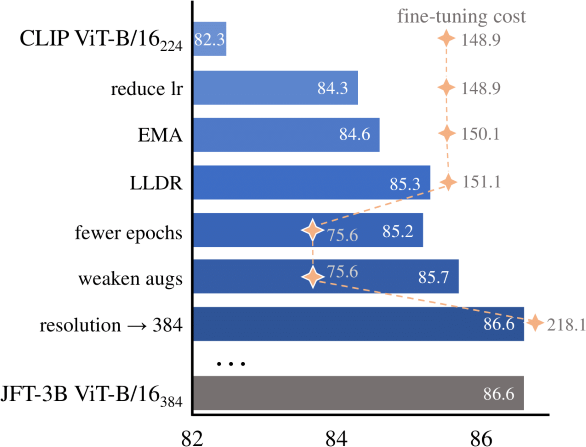

# FT-CLIP

This repo is the official implementation of ["CLIP Itself is a Strong Fine-tuner: Achieving 85.7% and 88.0% Top-1 Accuracy with ViT-B and ViT-L on ImageNet"](https://arxiv.org/abs/2212.06138).

## Introduction

Recent studies have shown that CLIP has achieved remarkable success in performing zero-shot inference while its fine-tuning performance is not satisfactory. In this paper, we identify that fine-tuning performance is significantly impacted by hyper-parameter choices. We examine various key hyper-parameters and empirically evaluate their impact in fine-tuning CLIP for classification tasks through a comprehensive study. We find that the fine-tuning performance of CLIP is substantially underestimated. Equipped with hyper-parameter refinement, we demonstrate CLIP itself is better or at least competitive in fine-tuning compared with large-scale supervised pre-training approaches or latest works that use CLIP as prediction targets in Masked Image Modeling. Specifically, CLIP ViT-Base/16 and CLIP ViT-Large/14 can achieve 85.7%, 88.0% finetuning Top-1 accuracy on the ImageNet-1K dataset. These observations challenge the conventional conclusion that CLIP is not suitable for fine-tuning, and motivate us to rethink recently proposed improvements based on CLIP.

 


## Results

<table>
    <tr>
       <th>  </th>
       <th>ViT-Base/16<sub>224</sub> </th>
       <th>ViT-Base/16<sub>384</sub> </th>
       <th>ViT-Large/16<sub>384</sub></th>
       <th>ViT-Large/14<sub>224</sub></th>
       <th>ViT-Large/14<sub>336</sub></th>
    </tr>
    <tr>
        <td>FLOPS</td> 
        <td>17.5G</td>
        <td>55.4G</td>
        <td>190.7G</td>
        <td>80.7G</td>
        <td>190.6G</td>
    </tr>
    <tr>
      <td colspan="6"><em>Supervised Baseline</em></td>
    </tr>
    <tr>
        <td>ImageNet-21K</td> 
        <td>84.0 </td>
        <td>86.2 </td>
        <td>87.1 </td>
        <td>---- </td>
        <td>---- </td>
    </tr>
    <tr>
        <td>JFT-300M </td> 
        <td>---- </td>
        <td>86.7 </td>
        <td>88.0 </td>
        <td>---- </td>
        <td>---- </td>
    </tr>
    <tr>
        <td>JFT-3B</td> 
        <td>---- </td>
        <td>86.6 </td>
        <td>88.5 </td>
        <td>---- </td>
        <td>---- </td>
    </tr>
    <tr>
      <td colspan="6"><em>MIM with CLIP as prediction target</em></td>
    </tr>
    <tr>
        <td>MVP</td>
        <td>84.4 </td>  <td>---- </td><td>---- </td><td>---- </td><td>---- </td>
    </tr>
    <tr>
        <td>FD-CLIP</td>
        <td>84.9 </td>   <td>---- </td><td>---- </td><td>---- </td><td>---- </td>
    </tr>
    <tr>
        <td>CAE-v2</td> 
        <td>85.3 </td> <td>---- </td><td>---- </td><td>---- </td><td>---- </td>
    </tr>
    <tr>
        <td>BEiT-2</td> 
        <td>85.5 </td>  <td>---- </td><td>---- </td><td>---- </td><td>---- </td>
    </tr>
    <tr>
      <td colspan="6"><em>Fine-tuning CLIP directly</em></td>
    </tr>
    <tr>
        <td>FT-CLIP(ours)</td> 
        <td><a href="https://github.com/LightDXY/FT-CLIP/tree/main/logs/CLIP_B16.log">85.7 </a> </td>
        <td><a href="https://github.com/LightDXY/FT-CLIP/tree/main/logs/CLIP_B16_384.log"> 86.6 </a> </td>
        <td> ----</td>
        <td><a href="https://github.com/LightDXY/FT-CLIP/tree/main/logs/CLIP_L14.log"> 88.0 </a> </td>
        <td><a href="https://github.com/LightDXY/FT-CLIP/tree/main/logs/CLIP_L14_336.log"> 88.3 </a> </td>
    </tr>
</table>

 
## Fine-tuning configs

The CLIP-Base/16 model can be fine-tuned on ImageNet-1k using 8 A100-40GB:

```bash
MODEL=CLIP_B16
OUTPUT_DIR=/path/to/save/your_model
DATA_PATH=/path/to/imagenet

echo $OUTPUT_DIR
mkdir -p $OUTPUT_DIR
cp $0 $OUTPUT_DIR

OMP_NUM_THREADS=1 python -m torch.distributed.launch --nproc_per_node=8 run_class_finetuning.py \
    --model ${MODEL} --data_path $DATA_PATH \
    --input_size 224 \
    --finetune True \
    --num_workers 8 \
    --output_dir ${OUTPUT_DIR} \
    --batch_size 256 --lr 6e-4 --update_freq 1 \
    --warmup_epochs 10 --epochs 50 \
    --layer_decay 0.6 \
    --drop_path 0 \
    --dist_eval --eval_all --no_save_ckpt \
    --enable_deepspeed \
    --clip_mean_and_std \
    --layer_scale_init_value 0 \
    --abs_pos_emb --disable_rel_pos_bias \
    --weight_decay 0.05 --mixup 0 --cutmix 0 \
    --nb_classes 1000  --model_prefix visual.\
    --model_ema --model_ema_decay 0.9998 \
    2>&1 | tee -a ${OUTPUT_DIR}/log.txt

```
- `--batch_size`: batch size per GPU.
- Effective batch size = `number of GPUs` * `--batch_size` * `--update_freq`. So in the above example, the effective batch size is `8*256*1 = 2048`.
- `--lr`: base learning rate.
- `--layer_decay`: layer-wise learning rate decay. The LR of i_th layer is `lr * layer_decay ** i.
- `--warmup_epochs`: learning rate warmup epochs.
- `--epochs`: total pre-training epochs.
- `--clip_mean_and_std`: use the CLIP norm factor, instead of the ImageNet norm.

see [scripts/](https://github.com/LightDXY/FT-CLIP/tree/main/scripts/) for more config

# Acknowledgments

This repository is modified from [BEiT](https://github.com/microsoft/unilm/tree/master/beit), built using the [timm](https://github.com/rwightman/pytorch-image-models) library, the [DeiT](https://github.com/facebookresearch/deit) repository and the [CLIP](https://github.com/openai/CLIP) repository. The CLIP model file is modified from [DeCLIP](https://github.com/Sense-GVT/DeCLIP).


# Citation
If you use this code for your research, please cite our paper.
```
@article{dong2022ftclip,
  title={CLIP Itself is a Strong Fine-tuner: Achieving 85.7% and 88.0% Top-1 Accuracy with ViT-B and ViT-L on ImageNet},
  author={Dong, Xiaoyi and Bao, Jianmin and Zhang, Ting and Chen, Dongdong and Shuyang, Gu and Zhang, Weiming and Yuan, Lu and Chen, Dong and Wen, Fang and Yu, Nenghai},
  journal={arXiv preprint arXiv:2212.06138},
  year={2022}
}
```


